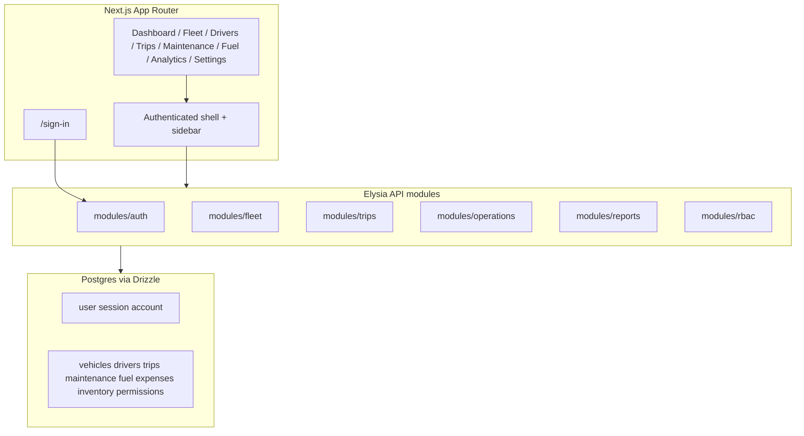

# TransitOps Implementation Plan

Build TransitOps end-to-end from the PRD and mockup on top of the existing Next.js + Elysia + Better Auth starter: domain glossary, schema, RBAC, nine app screens, business-rule enforcement, and local `.scratch/transitops/` tickets — using the mockup 5-state trip lifecycle and full mockup scope (inventory, revenue, RBAC matrix).

## Resolved Design Decisions

| Topic          | Choice                                                                                                                               |
| -------------- | ------------------------------------------------------------------------------------------------------------------------------------ |
| Trip lifecycle | **Mockup 5-state:** `Draft` → `Dispatched` → `InTransit` → `Completed`; `Cancelled` from `Dispatched` or `InTransit`                 |
| Scope          | **Full mockup extras:** inventory table, revenue KPIs/charts, Settings RBAC permission matrix                                        |
| Issue tracker  | Local markdown under [`.scratch/transitops/`](../.scratch/transitops/) per [docs/agents/issue-tracker.md](./agents/issue-tracker.md) |
| Starting point | Auth boilerplate only — no domain tables, no protected routes, no dashboard ([db/schema/auth-schema.ts](../db/schema/auth-schema.ts))   |

## PRD ↔ Mockup Reconciliation

Aligned terms we will use everywhere (to be written into [CONTEXT.md](../CONTEXT.md)):

| Concept        | Canonical term         | Values / notes                                                                                                        |
| -------------- | ---------------------- | --------------------------------------------------------------------------------------------------------------------- |
| Vehicle status | **Vehicle Status**     | `Available`, `OnTrip`, `InShop`, `Retired`                                                                            |
| Driver status  | **Driver Status**      | `Available`, `OnTrip`, `OffDuty`, `Suspended`                                                                         |
| Trip status    | **Trip Status**        | `Draft`, `Dispatched`, `InTransit`, `Completed`, `Cancelled`                                                          |
| User roles     | **Role**               | `FleetManager`, `Dispatcher`, `SafetyOfficer`, `FinancialAnalyst` (mockup login; PRD "Driver" maps to **Dispatcher**) |
| Driver metric  | **Safety Score**       | Numeric 0–100 shown as stars in UI (mockup "Performance")                                                             |
| Maintenance    | **Maintenance Record** | Active record forces vehicle `InShop`; closing restores `Available`                                                   |
| Revenue        | **Trip Revenue**       | Currency field on completed trips; feeds analytics KPIs                                                               |

**Mockup-only entities to add:** `InventoryItem` (name, quantity, reorder level, status).

**Deferred to post-v1 (bonus in PRD):** PDF export, email license reminders, vehicle document uploads, dark-mode toggle UI (infrastructure exists via [components/theme-provider.tsx](../components/theme-provider.tsx)).

---

## Domain Model (create during grill-with-docs)

### [CONTEXT.md](../CONTEXT.md) glossary (no implementation detail)

Core terms to define with `_Avoid_` aliases:

- **Vehicle**, **Driver**, **Trip**, **Maintenance Record**, **Fuel Log**, **Expense**, **Inventory Item**
- **Dispatch** (Draft → Dispatched + status side-effects)
- **Fleet Utilization**, **Fuel Efficiency**, **Operational Cost**, **Vehicle ROI**
- Status enums above

### ADRs to record in [docs/adr/](./adr/)

| ADR                                           | Decision                                                                             | Why                                                      |
| --------------------------------------------- | ------------------------------------------------------------------------------------ | -------------------------------------------------------- |
| `0001-trip-five-state-lifecycle.md`           | Add `InTransit` between `Dispatched` and `Completed`                                 | Mockup stepper; PRD had 4 states                         |
| `0002-rbac-permission-matrix.md`              | Role + module permission matrix (View/Create/Edit/Delete) stored in DB               | Mockup Settings screen; not just route-level role checks |
| `0003-status-transitions-in-service-layer.md` | Vehicle/Driver/Trip status changes enforced in Elysia service functions, not UI-only | PRD mandatory business rules                             |

### Spec file

Create [`.scratch/transitops/spec.md`](../.scratch/transitops/spec.md) synthesizing [docs/prd.md](./prd.md) + [docs/mockup.png](./mockup.png) with the resolved decisions above.

---

## Architecture

**Conventions (from [AGENTS.md](../AGENTS.md)):**

- Feature modules: `modules/<feature>/{feature}.schema.ts`, `{feature}.route.ts`, `index.ts`
- Mount routes in [app/api/[[...slugs]]/route.ts](../app/api/[[...slugs]]/route.ts)
- All mutations use `tryCatch`; forms use react-hook-form + Zod
- `requireAuth` on all domain routes; `requireSession()` on all app pages inside shell

---

## Database Schema

Extend [db/schema/](../db/schema/) with new files (re-export from [db/schema/index.ts](../db/schema/index.ts)):

### `roles` + `permissions` + `role_permissions`

- Seed 4 roles + default matrix matching mockup Settings screen
- `permissions`: `module` (fleet, drivers, trips, maintenance, fuel, analytics, settings) × `action` (view, create, edit, delete)

### Extend `user` (Better Auth)

- Add `roleId` FK (or `role` enum if simpler for hackathon — ADR picks matrix approach)

### `vehicles`

`id`, `registrationNumber` (unique), `name`, `type`, `maxLoadCapacityKg`, `odometerKm`, `acquisitionCost`, `region`, `status`, timestamps

### `drivers`

`id`, `name`, `licenseNumber`, `licenseCategory`, `licenseExpiryDate`, `contactNumber`, `safetyScore`, `status`, timestamps

### `trips`

`id`, `orderId`, `source`, `destination`, `vehicleId`, `driverId`, `cargoWeightKg`, `plannedDistanceKm`, `actualOdometerKm`, `fuelConsumedLiters`, `revenue`, `status`, timestamps

### `maintenance_records`

`id`, `vehicleId`, `serviceType`, `date`, `cost`, `notes`, `status` (`Open`/`Completed`), timestamps

### `fuel_logs`

`id`, `vehicleId`, `tripId?`, `liters`, `cost`, `date`, timestamps

### `expenses`

`id`, `vehicleId`, `tripId?`, `category` (toll, other), `amount`, `date`, timestamps

### `inventory_items`

`id`, `name`, `quantity`, `reorderLevel`, `status` (`InStock`/`LowStock`), timestamps

---

## Business Rules Engine

Centralize in `lib/transitops/rules.ts` (or per-module services) — called from trip/maintenance routes:

| Rule                                                                            | Enforcement point                                                                    |
| ------------------------------------------------------------------------------- | ------------------------------------------------------------------------------------ |
| Unique registration number                                                      | DB unique + API validation                                                           |
| Retired/InShop vehicles excluded from dispatch picker                           | Trip create/dispatch query filter                                                    |
| Expired license or Suspended driver blocked                                     | Trip dispatch validation                                                             |
| Vehicle/Driver already OnTrip blocked                                           | Trip dispatch validation                                                             |
| Cargo weight ≤ max capacity                                                     | Trip dispatch validation (mockup error box)                                          |
| Dispatch → vehicle+driver `OnTrip`, trip `Dispatched`                           | `dispatchTrip()`                                                                     |
| Dispatched → `InTransit`                                                        | `startTransit()`                                                                     |
| InTransit → `Completed` (requires odometer + fuel) → vehicle+driver `Available` | `completeTrip()`                                                                     |
| Cancel from Dispatched/InTransit → vehicle+driver `Available`                   | `cancelTrip()`                                                                       |
| Active maintenance → vehicle `InShop`                                           | `createMaintenance()`                                                                |
| Close maintenance → vehicle `Available` (unless Retired)                        | `closeMaintenance()`                                                                 |
| Operational cost per vehicle                                                    | Computed: sum(fuel_logs.cost) + sum(maintenance_records.cost) + sum(expenses.amount) |

---

## UI Plan (match [docs/mockup.png](./mockup.png))

### Shared shell — `app/(app)/layout.tsx`

- Dark left sidebar: Dashboard, Fleet, Drivers, Trips, Maintenance, Fuel & Expenses, Analytics, Settings
- Top bar: search (filter hookup optional v1), user avatar/menu
- Role-gated nav items via permission checks

### shadcn components to add

`sidebar`, `card`, `table`, `badge`, `select`, `dialog`, `dropdown-menu`, `avatar`, `tabs`, `chart` (for analytics), `progress`, `alert`

### Pages

| Route          | Mockup screen    | Key UI                                                          |
| -------------- | ---------------- | --------------------------------------------------------------- |
| `/sign-in`     | Auth             | Split layout: dark brand panel + form; redirect to `/dashboard` |
| `/dashboard`   | Dashboard        | 7 KPI cards, recent trips table, vehicle status bar chart       |
| `/fleet`       | Vehicle Registry | Filters (type, status, region), data table, Add Vehicle dialog  |
| `/drivers`     | Drivers & Safety | Table with safety stars, Add Driver dialog                      |
| `/trips`       | Trip Dispatcher  | 4-step stepper, dispatch form, inline validation errors         |
| `/maintenance` | Maintenance      | Log form + service history table + status flow note             |
| `/fuel`        | Fuel & Expenses  | Fuel logs + expenses tables + inventory section + total cost    |
| `/analytics`   | Reports          | KPI cards, monthly revenue chart, cost/unit chart, CSV export   |
| `/settings`    | Settings & RBAC  | Profile form + permission matrix editor                         |

### Visual tokens

Adjust [app/globals.css](../app/globals.css) `--primary` toward mockup orange for CTAs; use existing `--sidebar-*` tokens for dark nav. No arbitrary pixel values.

---

## API Modules

| Module               | Routes (prefix `/api`)                                                              |
| -------------------- | ----------------------------------------------------------------------------------- |
| `modules/rbac`       | `GET/PUT /permissions`, `GET /roles`                                                |
| `modules/fleet`      | CRUD `/vehicles`, CRUD `/drivers`                                                   |
| `modules/trips`      | CRUD `/trips`, `POST /trips/:id/dispatch`, `/start-transit`, `/complete`, `/cancel` |
| `modules/operations` | CRUD `/maintenance`, `/fuel-logs`, `/expenses`, `/inventory`                        |
| `modules/reports`    | `GET /dashboard-kpis`, `GET /analytics`, `GET /export/csv`                          |

All domain routes use `requireAuth` from [middleware/auth.ts](../middleware/auth.ts) plus permission checks from `modules/rbac`.

---

## Implementation Phases

Given **8-hour hackathon** + **expanded mockup scope**, execute in dependency order; each phase ends with a verifiable checkpoint.

### Phase 0 — Domain docs (30 min)

- Write [CONTEXT.md](../CONTEXT.md), 3 ADRs, [`.scratch/transitops/spec.md`](../.scratch/transitops/spec.md)
- Create local issue files `01`–`10` under `.scratch/transitops/issues/`

### Phase 1 — Foundation (90 min)

- Drizzle schema + `pnpm db:push`
- Seed roles/permissions + demo data script
- Extend user with role; wire `requireSession()` + app shell layout
- RBAC guard helper: `requirePermission(module, action)`

### Phase 2 — Fleet + Drivers (90 min)

- Vehicle/Driver CRUD API + Zod schemas
- `/fleet` and `/drivers` pages with tables and dialogs
- Status badges (green/blue/red/grey per mockup)

### Phase 3 — Trip lifecycle (120 min) — critical path

- Trip CRUD + dispatch/start-transit/complete/cancel endpoints
- All PRD validation rules + mockup capacity error UX
- `/trips` page with stepper and disabled dispatch on error

### Phase 4 — Maintenance (45 min)

- Maintenance create/close with automatic vehicle status transitions
- `/maintenance` page

### Phase 5 — Fuel, Expenses, Inventory (60 min)

- Logging APIs + operational cost aggregation
- `/fuel` page with both tables + inventory CRUD

### Phase 6 — Dashboard + Analytics (90 min)

- KPI query endpoints (fleet utilization, active trips, etc.)
- `/dashboard` and `/analytics` with charts + CSV export

### Phase 7 — Settings RBAC UI (45 min)

- Permission matrix editor for admin roles
- `/settings` page

### Phase 8 — Polish + verification (30 min)

- Login split layout polish
- `pnpm typecheck` → `pnpm lint` → `pnpm build` → `pnpm format`
- Walk through PRD demo scenario (Van-05 / Alex / 450kg trip)

**Risk:** Full mockup scope in 8h is tight. If time slips, cut order: Settings matrix editor → inventory → chart polish (keep CSV + KPI cards).

---

## Local Issue Tickets (`.scratch/transitops/issues/`)

| #   | Slug                      | Scope                                            |
| --- | ------------------------- | ------------------------------------------------ |
| 01  | `domain-docs`             | CONTEXT.md, ADRs, spec.md                        |
| 02  | `schema-rbac`             | Drizzle schema, seeds, permission guards         |
| 03  | `app-shell`               | Sidebar layout, protected routes, login redesign |
| 04  | `vehicle-registry`        | Fleet CRUD + `/fleet`                            |
| 05  | `driver-management`       | Driver CRUD + `/drivers`                         |
| 06  | `trip-lifecycle`          | 5-state machine + validations + `/trips`         |
| 07  | `maintenance-workflow`    | Maintenance + status transitions                 |
| 08  | `fuel-expenses-inventory` | Operations logging + `/fuel`                     |
| 09  | `dashboard-analytics`     | KPIs, charts, CSV + `/dashboard` `/analytics`    |
| 10  | `settings-rbac-matrix`    | Permission matrix UI + `/settings`               |

Each issue file gets `Status: ready-for-agent` when spec is complete.

---

## Success Criteria

- [ ] PRD demo scenario (steps 1–9) passes end-to-end
- [ ] All 9 mockup screens implemented with sidebar navigation
- [ ] Business rules enforced server-side (not UI-only)
- [ ] RBAC matrix controls page access and mutating actions
- [ ] Trip lifecycle matches 5-state mockup stepper
- [ ] `pnpm typecheck`, `pnpm lint`, `pnpm build` all pass
